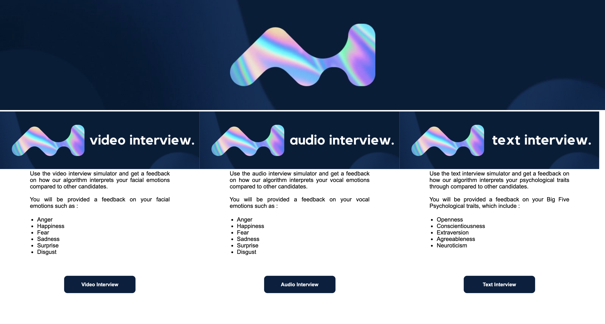
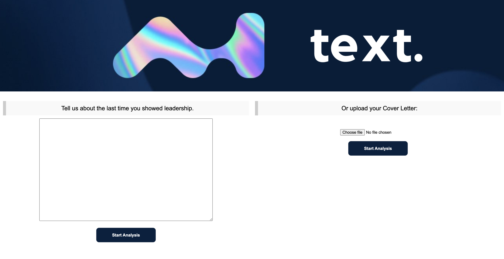
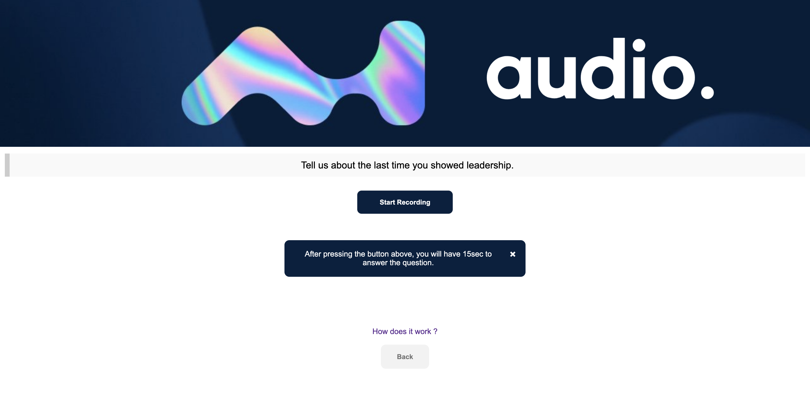
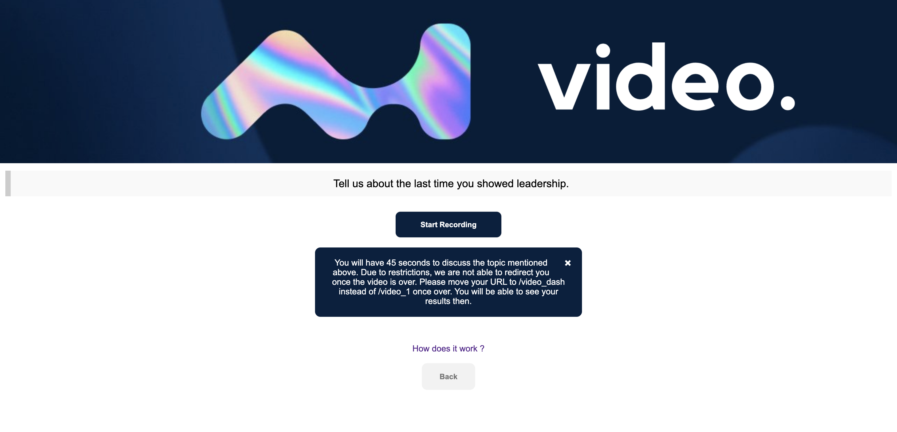
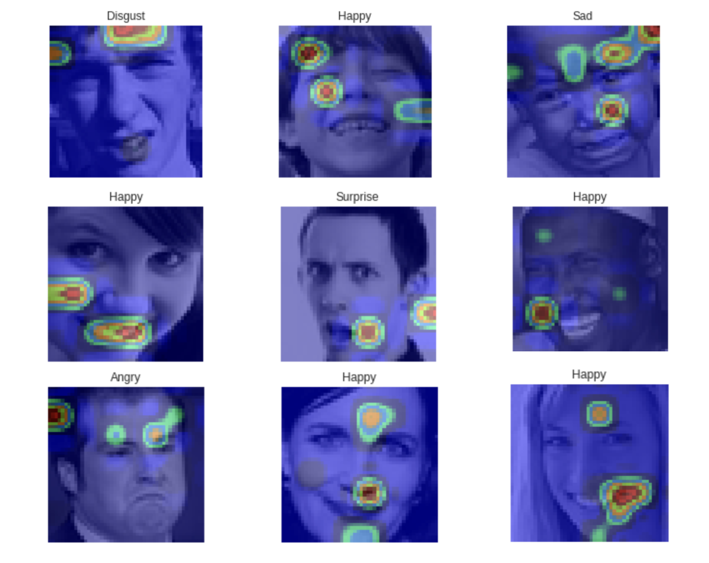

  

<h1 align="center">AI Interview System</h1>

  
  
  
  
  

  
  
  
  
  
  

# About

Selection in big companies requires an aspirant to be proficient in coding as well as fluent in his words. The latter sometimes becomes a major anchor for various students with the ability to achieve high otherwise. This is a problem that our current interface looks at resolving. We are building an interface that helps users with a situation by the use of an AI that asks questions on the basis of a code which the aspirant has written, asked from a diverse pack of frequently asked coding questions. Then the AI asks the aspirant questions related to his code and some staple questions. At the end of this experience, the user receives his interview profile showing him his flaws in answering questions, his fluency, and his ability to handle the situation verbally. This can be done on various levels and be stored for future scrutiny by the user. We can also provide a growth curve that helps the aspirant to judge his progress.

---
We developped a AI interview emotion recognition platform to analyze the emotions of job candidates.

We analye facial, vocal and textual emotions, using mostly deep learning based approaches. We deployed a web app using Flask :

---

The tool can be accessed from the WebApp repository, by installing the requirements and launching `main.py`.

## Technologies

---

## Methodology

Our aim is to develop a model able to provide a live sentiment analysis with a visual user interface.Therefore, we have decided to separate two types of inputs :
- Textual input, such as answers to questions that would be asked to a person from the platform
- Video input from a live webcam or stored from an MP4 or WAV file, from which we split the audio and the images

---

## Text Analysis

#### Pipeline

The text-based personality recognition pipeline has the following structure :
- Text data retrieving
- Custom natural language preprocessing :
	- Tokenization of the document
	- Cleaning and standardization of formulations using regular expressions
	- Deletion of the punctuation
	- Lowercasing the tokens
	- Removal of predefined *stopwords*
	- Application of part-of-speech tags on the remaining tokens
	- Lemmatization of tokens using part-of-speech tags for more accuracy.
	- Padding the sequences of tokens of each document to constrain the shape of the input vectors.
- 300-dimension **Word2Vec** trainable embedding
- Prediction using our pre-trained model

#### Model

We have chosen a neural network architecture based on both one-dimensional convolutional neural networks and recurrent neural networks.
The one-dimensional convolution layer plays a role comparable to feature extraction : it allows finding patterns in text data. The Long-Short Term Memory cell is then used in order to leverage on the sequential nature of natural language : unlike regular neural network where inputs are assumed to be independent of each other, these architectures progressively accumulate and capture information through the sequences. LSTMs have the property of selectively remembering patterns for long durations of time.
Our final model first includes 3 consecutive blocks consisting of the following four layers : one-dimensional convolution layer - max pooling - spatial dropout - batch normalization. The numbers of convolution filters are respectively 128, 256 and 512 for each block, kernel size is 8, max pooling size is 2 and dropout rate is 0.3.
Following the three blocks, we chose to stack 3 LSTM cells with 180 outputs each. Finally, a fully connected layer of 128 nodes is added before the last classification layer.

---

## Audio Analysis

#### Pipeline

The speech emotion recognition pipeline was built the following way :
- Voice recording
- Audio signal discretization
- Log-mel-spectrogram extraction
- Split spectrogram using a rolling window
- Make a prediction using our pre-trained model

#### Model

The model we have chosen is a **Time Distributed Convolutional Neural Network**.

The main idea of a **Time Distributed Convolutional Neural Network** is to apply a rolling window (fixed size and time-step) all along the log-mel-spectrogram.
Each of these windows will be the entry of a convolutional neural network, composed by four Local Feature Learning Blocks (LFLBs) and the output of each of these convolutional networks will be fed into a recurrent neural network composed by 2 cells LSTM (Long Short Term Memory) to learn the long-term contextual dependencies. Finally, a fully connected layer with *softmax* activation is used to predict the emotion detected in the voice.

To limit overfitting, we tuned the model with :
- Audio data augmentation
- Early stopping
- And kept the best model

    

---

## Video Analysis

#### Pipeline

The video processing pipeline was built the following way :
- Launch the webcam
- Identify the face by Histogram of Oriented Gradients
- Zoom on the face
- Dimension the face to 48 * 48 pixels
- Make a prediction on the face using our pre-trained model
- Also identify the number of blinks on the facial landmarks on each picture

#### Model

The model we have chosen is an **XCeption** model, since it outperformed the other approaches we developed so far. We tuned the model with :
- Data augmentation
- Early stopping
- Decreasing learning rate on plateau
- L2-Regularization
- Class weight balancing
- And kept the best model

The XCeption architecture is based on DepthWise Separable convolutions that allow to train much fewer parameters, and therefore reduce training time on Colab's GPUs to less than 90 minutes.

When it comes to applying CNNs in real life application, being able to explain the results is a great challenge. We can indeed  plot class activation maps, which display the pixels that have been activated by the last convolution layer. We notice how the pixels are being activated differently depending on the emotion being labeled. The happiness seems to depend on the pixels linked to the eyes and mouth, whereas the sadness or the anger seem for example to be more related to the eyebrows.

## Ensemble Model

The ensemble model has not been implemented on this version.

---

## How to use it ?

There are several resources available :
- the working notebooks can be found in the Text/Video/Audio sections
- the final notebooks can be accessed through the Google Colab link in the table at the beginning

To use the web app :
- Clone the project locally
- Go in the WebApp folder
- Run `$ pip install -r requirements.txt``
- Launch `python app.py`

## How to Contribute to AI Interview System?

- Take a look at the Existing [Issues](https://github.com/aryasoni98/AI-Interview/issues) or create your own Issues!
- Wait for the Issue to be assigned to you.
- Fork the repository
- Have a look at [Contibuting Guidelines](https://github.com/aryasoni98/AI-Interview/blob/master/CONTRIBUTING.md)

---

#### [Welcome to AI-Interview Discussions !](https://github.com/aryasoni98/AI-Interview/discussions)

---

### ❤️ Project Member

 <table>
 	<tr>
 		<td align="center">
 			<a href="https://github.com/aryasoni98">
 				
 				  <b>Arya Soni</b>
 			</a>
 			  <a href="https://github.com/aryasoni98">
 		   Admin
 	    </a>
 		</td>
		 <td align="center">
 			<a href="https://github.com/shubhigupta991">
 				
 				  <b>Shubhangi Gupta</b>
 			</a>
 			  <a href="https://github.com/shubhigupta991">
 		   Mentor
 	    </a>
 		</td>
 	</tr>
 </table>
 

### 🌟 Contributors

### Thanks goes to these wonderful people ✨✨:

<table>
	<tr>
		<td>
			
		</td>
	</tr>
</table>

