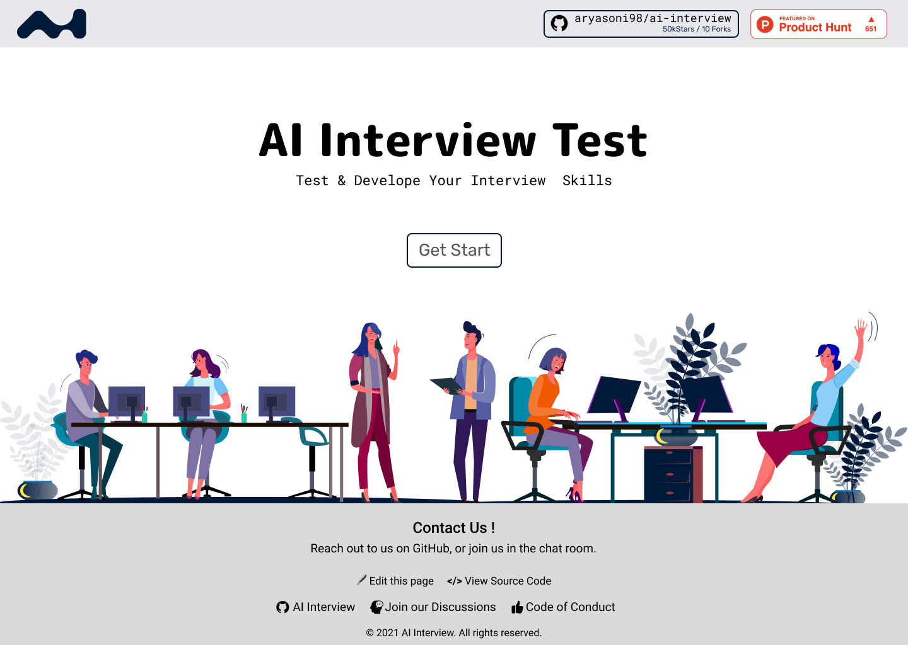
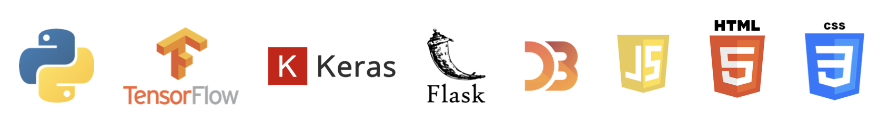
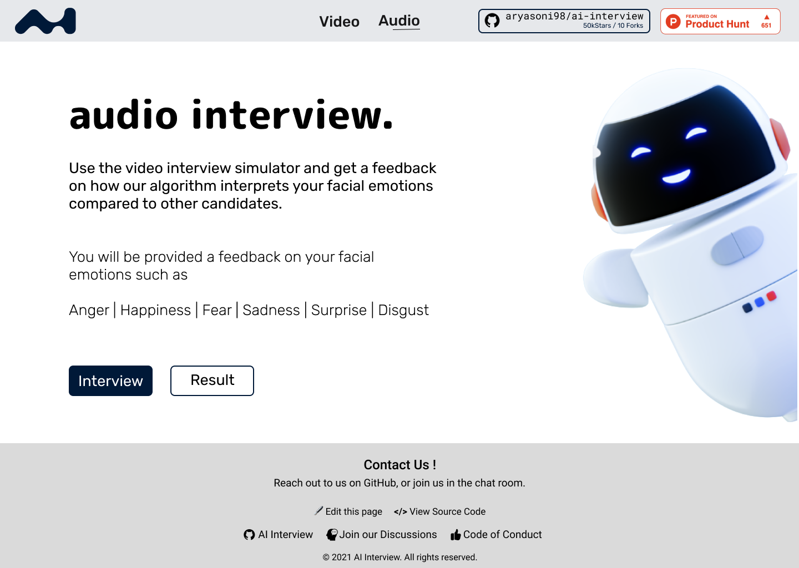

  

<h1 align="center">AI Interview System</h1>

  
  
  
  
  

  
  
  
  
  
  

# About

Selection in big companies requires an aspirant to be proficient in coding as well as fluent in his words. The latter sometimes becomes a major anchor for various students with the ability to achieve high otherwise. This is a problem that our current interface looks at resolving. We are building an interface that helps users with a situation by the use of an AI that asks questions on the basis of a code which the aspirant has written, asked from a diverse pack of frequently asked coding questions. Then the AI asks the aspirant questions related to his code and some staple questions. At the end of this experience, the user receives his interview profile showing him his flaws in answering questions, his fluency, and his ability to handle the situation verbally. This can be done on various levels and be stored for future scrutiny by the user. We can also provide a growth curve that helps the aspirant to judge his progress.

---

AIM : We developed an AI interview emotion recognition platform to analysis the emotions of job candidates.

---

    

The tool can be accessed from the WebApp repository, by installing the requirements and launching `WebApp/app.py`.

---

### Technologies

---

### Methodology

Our aim is to develop a model able to provide a live sentiment analysis with a visual user interface.Therefore, we have decided to separate two types of inputs :
- Video input from a live webcam or stored from an MP4 or WAV file, from which we split the audio and the images

---

### Video Analysis - [Read More . . .](https://github.com/aryasoni98/AI-Interview/wiki/Video-Analysis)
 

    

---

### Audio Analysis - [Read More . . . ](https://github.com/aryasoni98/AI-Interview/wiki/Audio-Analysis)
 

    

---

---

## How to use it ?

To use the **WebApp** ( Server Side ):
- Clone the project locally
- Go in the WebApp folder
- Run `pip install -r requirements.txt`
- Launch `python app.py`
- Alternatively, skip all the steps by using  

Install **PyAudio** [ Window , Mac ](https://stackoverflow.com/questions/52283840/i-cant-install-pyaudio-on-windows-how-to-solve-error-microsoft-visual-c-14)

- ### Window :
- - CMD `pip install pipwin`
- - CMD `pipwin install pyaudio`

- ### Mac :
- - `brew install portaudio`

To use the **Application** ( Client Side ):
- Go in the Application folder.
- Run `npm install -g && npm start`
- Launch
- Alternatively, skip all the steps by using  

The web app has been **Dockerized** ( **Application && WebApp Folder** )
- First install [Docker](https://www.docker.com/products/docker-desktop)
- Second build the image, Run `docker-compose build`
- Then start/run the container, run `docker-compose up`
---
## Improve Model Accuracy : [AI-Interview-ML](https://github.com/aryasoni98/AI-Interview-ML)
---
## Figma UI Design : [AI-Interview](https://www.figma.com/file/l6u5emxKaNnX4EYDYhPley/AI-Interview?node-id=0%3A1)
---
## How to Contribute to AI Interview System?

- Take a look at the Existing [Issues](https://github.com/aryasoni98/AI-Interview/issues) or create your own Issues!
- Wait for the Issue to be assigned to you.
- Fork the repository
- Have a look at [Contibuting Guidelines](https://github.com/aryasoni98/AI-Interview/blob/master/CONTRIBUTING.md)

---

<table>
 	<tr>
 		<td align="center">
 			
 				 
			 <a href="https://github.com/aryasoni98/AI-Interview/discussions">
 		   		Github Discussions
 	    	</a>
 		</td>
 	</tr>
 </table>

---

### Project Member ❤️

<table>
 	<tr>
 		<td align="center">
 			<a href="https://github.com/aryasoni98">
 				
 				  <b>Arya Soni</b>
 			</a>
 				  <a href="https://github.com/aryasoni98">
 		   			Admin
 	   		 </a>
 		</td>
		<td align="center">
 			<a href="https://github.com/shubhigupta991">
 				
 				  <b>Shubhangi Gupta</b>
 			</a>
				 <a href="https://github.com/shubhigupta991">
					Member
 	    	</a>
 		</td>
        </td>
 	</tr>
</table>

---

### Contributors 🌟

#### Thanks goes to these wonderful people ✨✨:

<table>
	<tr>
		<td>
			
		</td>
	</tr>
</table>

---
