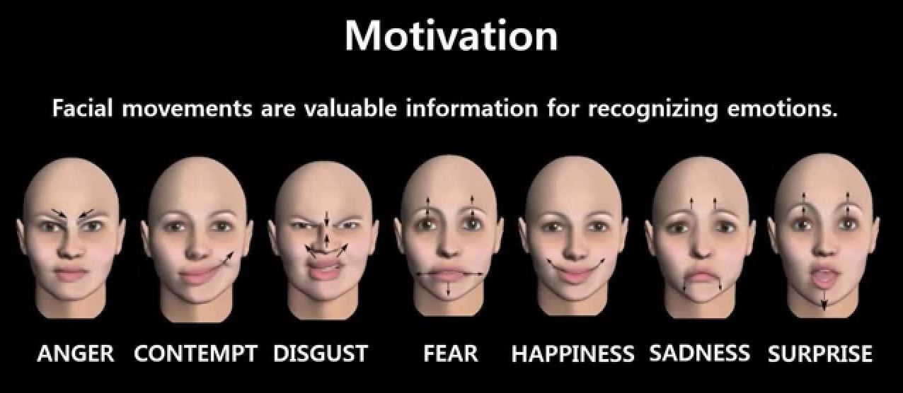
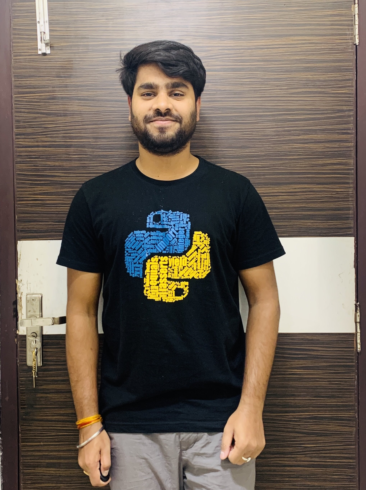

# AI Interview Preparation

Selection in big companies requires an aspirant to be proficient in coding as well as fluent in his words. The latter sometimes becomes a major anchor for various students with the ability to achieve high otherwise. This is a problem that our current interface looks at resolving. We are building an interface that helps users with a situation by the use of an AI that asks questions on the basis of a code which the aspirant has written, asked from a diverse pack of frequently asked coding questions. Then the AI asks the aspirant questions related to his code and some staple questions. At the end of this experience, the user receives his interview profile showing him his flaws in answering questions, his fluency, and his ability to handle the situation verbally. This can be done on various levels and be stored for future scrutiny by the user. We can also provide a growth curve that helps the aspirant to judge his progress.

### Stage 1 : Video Facial Expression Detection with Fast.ai and OpenCV

##### Use a deep learning model to predict facial expressions from a videostream.

### Kaggle : [Dataset](https://www.kaggle.com/jonathanoheix/face-expression-recognition-dataset)

### Requirements

- [Fast.ai library](https://docs.fast.ai/install.html)
- [Dlib](https://www.pyimagesearch.com/2017/03/27/how-to-install-dlib/)
- Numpy
- Scipy
- IMutils
- OpenCV
- Pandas
- Argparse
- Python

#### Detect facial expression from live video
run "python liveVideoFrameRead.py"

Additional tags:
- --save to save video with predictions and landmarking
- --savedata to save csv file with expression predictions, their probability tensor and eye aspect ratio

#### Detect facial expression from video file
run "python videoFrameRead.py --video-file [your video file.mov]" where the video file needs to be in current directory

Additional tags:
- --frame-step the frame rate at which predictions are made, default was set to 10 frames
- --save to save video with predictions and landmarking
- --savedata to save csv file with expression predictions, their probability tensor and eye aspect ratio

### Stage 2 : Speech Emotion Recognition

Speech Emotion Recognition, abbreviated as SER, is the act of attempting to recognize human emotion and affective states from speech. This is capitalizing on the fact that voice often reflects underlying emotion through tone and pitch.

#### Datasets used in this project
- -- Crowd-sourced Emotional Mutimodal Actors Dataset (Crema-D)
- -- Ryerson Audio-Visual Database of Emotional Speech and Song (Ravdess)
- -- Surrey Audio-Visual Expressed Emotion (Savee)
- -- Toronto emotional speech set (Tess)

#### Dataset : [Download](https://drive.google.com/drive/folders/1d_Yz9D0A5HXKrTr3N2nrpO8jP85iFxcb?usp=sharing)
#### Model : [Download](https://drive.google.com/drive/folders/1oyEA82s3H22pO1FBjaSmnjg_KESpb4cK?usp=sharing)

## How to Contribute to AI Interview Preparation?

- Take a look at the Existing [Issues](https://github.com/CodeTrophs/AI-Interview-Test/issues) or create your own Issues!
- Wait for the Issue to be assigned to you.
- Fork the repository
- Have a look at [Contibuting Guidelines](https://github.com/CodeTrophs/AI-Interview-Test/blob/main/CONTRIBUTING.md)

## ❤️ Project Admin

<table>
	<tr>
		<td align="center">
			<a href="https://github.com/aryasoni98">
				
				  <b>Arya Soni</b>
			</a>
			  <a href="https://github.com/aryasoni98">
		👑 Admin
	    </a>
		</td>
	</tr>
</table>
